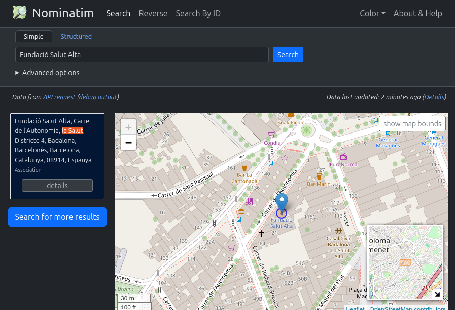

# Preguntes més freqüents

## Com es poden registrar els telèfons de contacte en cas d'emergència?

Hi ha dues possibilitats per registrar el telèfon de contacte en cas d'emergència per a un contacte determinat.

(A) Si aquest contacte d'emergència ja està vinculat amb el contacte en qüestió a través d'alguna relació només cal assegurar-se de registrar el telèfon en el contacte corresponent. En la pestanya de relacions del contacte es poden veure els telèfons dels contactes relacionats.

(B) Si no volem crear el contacte en el CRM o no tenim manera de relacionar-lo amb el contacte principal, tenim la possibilitat d'enregistrar el telèfon com ho fariem per als telèfons del mateix contacte però utilitzant (encara que aquesta no sigui la seva finalitat) el camp destinat per a l'extensió del telèfon per tal de desar la referència del contacte d'emergència. Cal tenir en compte que aquest camp tan sols ens permetrà desar un màxim de 16 caràcters.

## Es poden desar les adreces antigues dels contactes?

En el CiviCRM, quan fem un canvi d'adreça d'un contacte, sobreescrivim la informació existent i perdem la informació referent a l'adreça original. En alguns casos però ens pot interessar mantenir un històric dels canvis d'adreça dels contactes. Per fer-ho, s'ha creat un tipus d'activitat **"Canvi d'adreça"** que ens permetrà registrar un canvi d'adreça en un moment determinat i desar l'adreça original.

Per tant, sempre que volguem conservar una adreça abans de fer-hi un canvi, haurem de tenir en compte de registrar una activitat del tipus "Canvi d'adreça" desant l'adreça original.

## Donada una adreça postal com puc saber-ne el barri al qual pertany?

Es pot cercar el barri amb l'eina **Nominatim d'OpenStreetMap** [fent clic sobre el mapa](https://nominatim.openstreetmap.org/ui/reverse.html) o bé [cercant l'adreça](https://nominatim.openstreetmap.org/ui/search.html) (només carrer, número i població) i desplegant els detalls de l'adreça.

