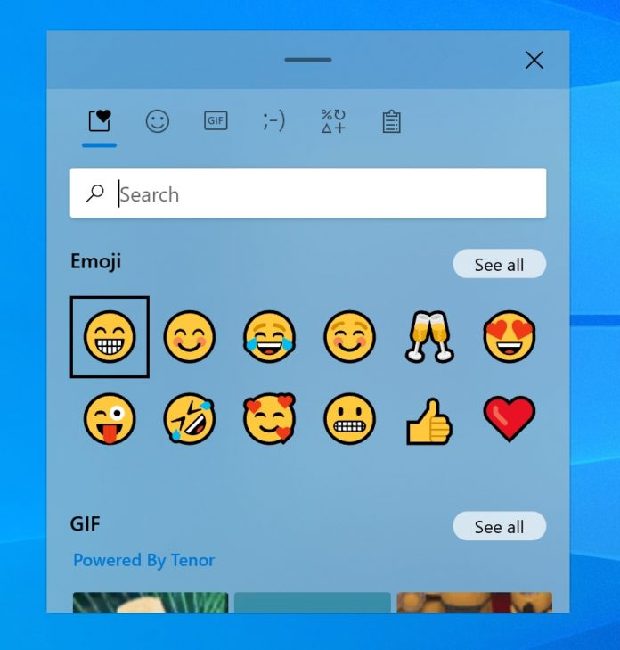

Aquesta secció recull un seguit de consells i trucs, alguns de més bàsics, altres de més avançats, que permeten incrementar la productivitat i efectivitat a l'hora de treballar.

## Dreceres de teclat i ratolí per anar per feina ⚡️

| Drecera                                    | Acció                                                                        |
| ------------------------------------------ | ---------------------------------------------------------------------------- |
| `Ctrl` + `C`                               | Copiar                                                                       |
| `Ctrl` + `V`                               | Enganxar                                                                     |
| `Ctrl` + `X`                               | Tallar                                                                       |
| `Ctrl` + `Mayus` + `V`                     | Enganxar sense format                                                        |
| `Ctrl` + `Z`                               | Desfer                                                                       |
| `Ctrl` + `Y`                               | Refer                                                                        |
| `Ctrl` + `F`                               | Cercar                                                                       |
| `Ctrl` + `S`                               | Desar                                                                        |
| `Ctrl` + `B`                               | Negreta                                                                      |
| `Ctrl` + `I`                               | Cursiva                                                                      |
| `Alt` + `Tab`                              | Alternar de finestra                                                         |
| `Ctrl` + `T`                               | Obrir nova pestanya                                                          |
| `Ctrl`+ `W`                                | Tancar pestanya o finestra en ús                                             |
| `Ctrl` + `Mayus` + `T`                     | Obrir darrera pestanya tancada                                               |
| `Ctrl` + `Tab`                             | Canviar a la següent pestanya                                                |
| `Ctrl` + `Mayus` + `Tab`                   | Canviar a l'anterior pestanya                                                |
| `Ctrl`+ `A`                                | Selecciona tot el text                                                       |
| `Ctrl` + 🖱 `Clic al botó esquerra` (sobre un enllaç) | Obrir enllaç en una nova pestanya                                |
| 🖱 `Clic al botó del mig` (sobre un enllaç) | [Obrir enllaç en una nova pestanya](#la-rodeta-del-ratoli-tambe-es-clicable) |
| 🖱 `Doble clic botó esquerra`               | Seleccionar una paraula                                                      |
| 🖱 `Triple clic botó esquerra`              | Seleccionar una línia                                                        |
| `Ctrl` + 🖱 `Rodeta del ratolí amunt/avall` | Apropar/Allunyar                                                             |
| `Ctrl` + `0`                               | Restablir zoom                                                               |
| :fontawesome-brands-windows: + `.`         | [Obrir selector de pictogrames](#pictogrames-emojis-a-un-clic)               |

=== ":fontawesome-brands-firefox: Firefox"

    | Drecera               | Acció                          |
    | --------------------- | ------------------------------ |
    | `Ctrl` + `Mayus` + `P`| Nova finestra d'incògnit       |

=== ":fontawesome-brands-chrome: Chrome"

    | Drecera               | Acció                          |
    | --------------------- | ------------------------------ |
    | `Ctrl` + `Mayus` + `N`| Nova finestra d'incògnit       |

## Optimització de la gestió del correu electrònic 📧

En el següent article podeu trobar alguns consells i trucs de com gestionar i optimitzar la gestió dels vostres Gmails. Pels qui no els tingueu per la mà potser us poden ajudar a fer més digerible el vostre dia a dia digital.

[Com optimitzar la gestió del correu electrònic](https://www.babu.cat/babuteca/optimitzar-gestio-correu-electronic)

## Eines d'idioma (Language Tool) 🔠

[LanguageTool](https://languagetool.org/ca) és un corrector ortogràfic, gramatical i d’estil que ajuda a corregir o reformular textos. Una eina imprescindible que té diferents opcions de descàrrega:

- Les seves extensions per [Chrome](https://chrome.google.com/webstore/detail/grammar-and-spell-checker/oldceeleldhonbafppcapldpdifcinji) i [Firefox](https://addons.mozilla.org/firefox/addon/languagetool/)
- Els seus complements per [Microsoft Word](https://languagetool.org/ca/word) i per [LibreOffice](https://languagetool.org/ca/libre-office)

## Optimització del navegador

Fixar pestanyes permet mantenir obertes les teves pàgines web preferides. Les pestanyes fixades s'obren automàticament en iniciar el navegador i, el que també és d'agraïr, queden col·lapsades i estalvien espai en una barra de pestanyes que té tendència a quedar força sobrecarregada.

!!! Tip "Fixar pestanya"
    Per fixar una pestanya només has de fer clic al botó dret del ratolí sobre la pestanya en qüestió i seleccionar `Fixar pestanya`.

Una configuració imprescindible que no ve per defecte en els navegadors és la d'**indicar obrir el navegador amb totes les pestanyes que estaven obertes abans de tancar-lo**. D'aquesta manera no cal preocupar-se de perdre el fil a l'hora de tancar el navegador.

[:fontawesome-brands-chrome: Configurar "Continuar des d'on es va deixar" (amb Chrome)](https://support.google.com/chrome/answer/95314?hl=ca&co=GENIE.Platform%3DDesktop&sjid=1852817060369143215-EU#)

[:fontawesome-brands-firefox: Configurar "Continuar des d'on es va deixar" (amb Firefox)](https://support.mozilla.org/es/kb/restaurar-sesion-anterior-configurar-como-firefox-#w_configurar-la-restauracion-de-sesion)

## Seguretat i gestió de contrasenyes 🔒

Quatre bàsics per garantir uns mínims de seguretat amb tots els comptes que requereixin contrasenyes:

- **MAI s'ha d'utilitzar una mateixa contrasenya** per més d'un compte
- **PROHIBIT guardar contrasenyes** en llibretes, papers, fitxers que no estiguin degudament protegits
- **PROHIBIT compartir contrasenyes per escrit** (whatsap, mail, etc)
- **Les contrasenyes han de ser segures**, la majoria d'eines ja ho obligen, però si no és el cas, assegurar-se de que tinguin una llargada d'almenys 8 caràcters i combinar majúscules, minúscules, números i caràcters “especials”
- És altament recomanable **anar canviant les contrasenyes d'en tant en tant**. Sobretot les de comptes més crítics.
- Si heu de desar contrasenyes en algun lloc, o compartir-les amb l'equip, una bona eina és el **gestor de contrasenyes [KeepassXC](https://keepassxc.org/)**, permet gestionar un conjunt de contrasenyes guardades en un únic fitxer protegit per un única contrasenya (que òbviament ha de ser segura i heu de tenir en bona cura).
- Una altra bona opció és no apuntar-se les contrasenyes, deixar que el navegador (Chrome, Firefox,...) les gestioni i en cas de necessitar-la i no tenir-la a l'abast, utilitzar l'opció de **recuperació de contrasenya via correu electrònic**. Dit d'una altra manera, la contrasenya del correu electrònic ha de ser la única que cal recordar i des del correu electrònic s'han de poder recuperar la resta de contrasenyes. Aquesta opció és molt millor que tenir les contrasenyes apuntades i poc protegides.

## Eines de programari lliure 🆓

| Popular      | Alternativa programari lliure 👍                          | Funció |
| --------------- | ------------------------------ | ---- |
| Chrome| [Firefox](https://www.mozilla.org/ca/firefox/) |Navegador|
| Microsoft Office| [Libre Office](https://www.softcatala.org/programes/libreoffice/) | Paquet ofimàtic (processador de text, full de càlcul i programa de presentacions) |
| Adobe Photoshop    | [Gimp](https://www.softcatala.org/programes/gimp/) | Edició d'imatges|
| Adobe Indesign| [Inkscape](https://www.softcatala.org/programes/inkscape/) |Edició de gràfics vectorials|
| Adobe Reader | | | Visualització i impressió de documents en format PDF |
| - | [Audacity](https://www.softcatala.org/programes/audacity/) | Edició d'àudio |
| Adobe Premiere | [Open Shot](https://www.softcatala.org/programes/openshot/) | Edició de vídeo |
| - | [7-zip](https://www.softcatala.org/programes/7-zip/) | Compressor i descompressor de fitxers |
| Microsoft Outlook | [Thunderbird](https://www.softcatala.org/programes/paquet-catala-valencia-per-al-thunderbird/) | Client de correu electrònic
| Windows | Linux ([Ubuntu](https://ubuntu.com/)) | Sistema Operatiu|

## La rodeta del ratolí també és clicable 🖱

No de tots és conegut que la rodeta del ratolí també és un botó (#ElBotoDelMig). Una de les utilitats més destacades d'aquest botó és la que permet obrir noves pestanyes en un navegador clicant sobre d'enllaços estalviant-nos així haver de fer clic amb el botó dret per seguidament seleccionar l'opció “Obre l'enllaç en una pestanya nova”.

Com a mostra un exemple en el que s'aprofita per obrir els resultats d'una cerca de contactes al CRM en dues noves pestanyes:

*[Improve quicksearch result presentation to enable browser link functions](https://github.com/civicrm/civicrm-core/pull/19779)*

Una drecera equivalent i potser més còmoda i tot és `Ctrl` + 🖱 `Clic al botó esquerra` (sobre un enllaç).

## Pictogrames (emojis) a un clic 👆

Un emoji, a vegades, val més que mil paraules. Per això, cada vegada és més important poder-los tenir a mà per utilitzar-los. Sabies que des del Windows pots utilitzar la drecera de teclat [:fontawesome-brands-windows: + ``.``](https://support.microsoft.com/es-es/windows/windows-trucos-y-sugerencias-para-el-teclado-588e0b72-0fff-6d3f-aeee-6e5116097942) per utilitzar un selector de emojis?

{ width="400" }

Amb Linux hi ha l'extensió de Gnome [Emoji Copy](https://extensions.gnome.org/extension/6242/emoji-copy).