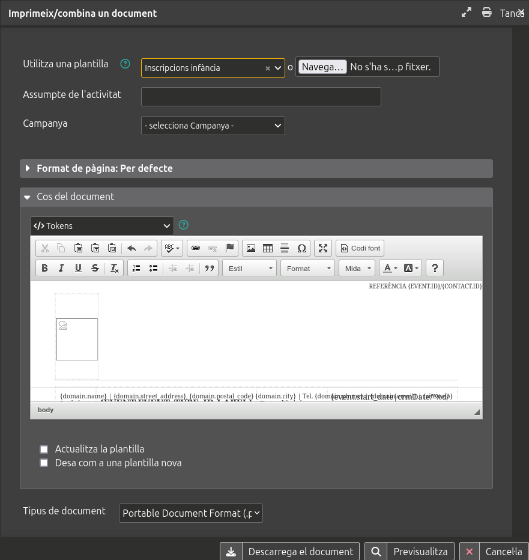

# Guia d'ús

## Generació de fulls d’inscripció PDF

Per generar el full d'inscripció en PDF a un esdeveniment d'un contacte infància des de la finestra **Imprimeix/combina un document** cal seleccionar la plantilla `Inscripcions infància` i seguidament clicar al botó **Descarrega el document**.

Els PDF es poden generar d'un en un o varis a la vegada.

### D’un en un

Des de la fitxa de contacte a la pestanya d’esdeveniments amb una de les següents opcions

A) clicant al desplegable d’opcions i seleccionant l’opció **🖨️ Carta PDF - imprimeix pels participants**

B) visualitzant la inscripció en qüestió i clicant a **🖨️ PDF letter - print for participant**

### Varis a la vegada

1. Des d’una cerca de participants

    A. des de **Cerca > Cerca de participants**

    B. llistant els participants des d’**Esdeveniments > Gestió d’esdeveniments**

2. Seleccionant les inscripcions que es volen generar

3. Seleccionant l’opció **🖨️ Carta PDF - imprimeix pels participants**`** del desplegable d’accions.

### Requisits

És indispensable, abans d'imprimir el full d'inscripció, haver incorporat totes les dades al CRM. Concretament les dades de l'esdeveniment, les del participant, la relació d'escolarització del participant i les relacions amb els tutors legals del participant juntament amb les seves dades. A continuació es detallen quins son els camps que queden reflectits en la fitxa d'inscripció.

#### Dades de l'esdeveniment

- Tipus d'esdeveniment
- Títol de l'esdeveniment
- Data d'inici de l'esdeveniment
- Data de finalització de l'esdeveniment

#### Dades del participant

- Nom
- Cognoms
- Data de naixement
- Tipus de document d'identitat i número de document d'identitat
- Adreça postal
- Codi postal
- Població
- Telèfon personal

#### Dades de salut del participant

- Número de targeta sanitària
- Vacunes
- Malalties especials
- Al·lèrgies
- Discapacitats
- Mobilitat
- Alimentació
- Medicaments
- Altres observacions

#### Dades escolars del participant

- Centre educatiu
- Etapa
- Curs

#### Dades dels tutors legals

- Nom
- Cognoms
- Tipus de document d'identitat i número de document d'identitat
- Nacionalitat
- Telèfon personal
- Gènere

#### Autoritzacions i acords de l'esdeveniment

- Autoritzacions i acords

#### Avís legal de l'esdeveniment

- Avís legal
